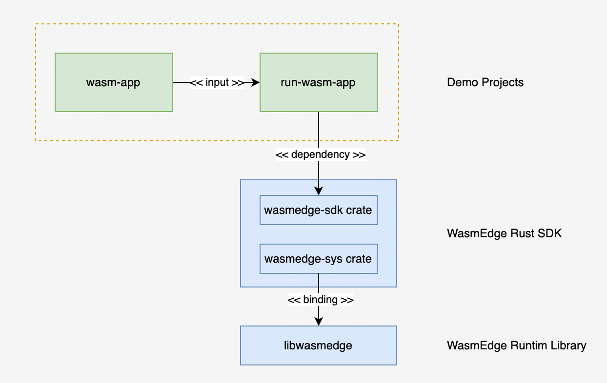

# Build and Run a WebAssembly Application with WasmEdge Rust SDK

## Introduction

In this article, we'll walk through how to create a WebAssembly application<sup>[1]</sup> (also *wasm app*) and how to run it over WasmEdge Runtime.

> <div id="wasm-app"></div>
>
> [1] A WebAssembly application is a common application but compiled into a WebAssembly binary instead of a general execution binary. A wasm app runs in a WebAssembly environment. For convenience, we usually call it a *wasm app*.

## Planning the demo code

We'll create two separate projects for this tutorial:

- `wasm-app` project creates a wasm app, in which a simple greeting message is printed out on the screen.
- `run-wasm-app` project creates a WasmEdge *[**Vm**](https://wasmedge.github.io/WasmEdge/wasmedge_sdk/struct.Vm.html)* instance that loads the binary of `wasm-app` and runs it over WasmEdge Runtime.

The architecture diagram of the projects used in this tutorial is presented below: the green rectangles are the two projects we will created, while the blue ones are the dependencies.



## Prerequisites

- Operating System: Ubuntu-20.04+, macOS-11+, Windows WSL2

- Install `rustup` and `Rust`

  Follow the instructions on the official [Rust-lang website](https://www.rust-lang.org/tools/install) to install `rustup` and `Rust`<sup>[2]</sup>; then, run the following command in your terminal program to add `wasm32-wasi`<sup>[3]</sup> target to the toolchain:

  ```bash
  // add the wasm32-wasi compilation target to the toolchain
  rustup target add wasm32-wasi
  ```

  ><div id="rust-stable"></div>
  >
  >[2] The version of Rust-language should be 1.63 or above.
  >
  ><div id="wasm32-wasi"></div>
  >
  >[3] The introduction to `wasm32-wasi` target

- Install WasmEdge Runtime Library

  The WasmEdge Runtime library (`libwasmedge`) is a C++ library, which provides a WebAssembly runtime. In this tutorial we use `WasmEdge v0.11.2`. The [Installation and Uninstallation](https://wasmedge.org/book/en/quick_start/install.html) section of Wasmedge Book gives the methods of installation, or you can also run the following instructions in your terminal program to install:

  ```bash
  // Download and run the installation script
  // The wasmedge library and other relevant files will be installed in the directory of $HOME/.wasmedge
  curl -sSf https://raw.githubusercontent.com/WasmEdge/WasmEdge/master/utils/install.sh | bash
  
  // Make the installed binary available in the current session of your terminal program
  source $HOME/.wasmedge/env
  ```

## Building the application

Let's make a directory named `workspace`, in which we'll do all the coding jobs:

```bash
mkdir workspace
cd workspace
```

### Step 1: Creating the wasm application: `wasm-app`

There is no difference between creating a wasm app project and a common Rust application project. In your terminal program, run the following command:

```bash
// in workspace/
// create a Rust application named `wasm-app`
cargo new wasm-app --bin
```

This command will create a directory called `wasm-app` with a boilerplate Rust app inside. Let's navigate into the  `wasm-app/src` directory, open `main.rs` and add the following code in the `main` function:

```rust
// workspace/wasm-app/src/main.rs

fn main() {
  // add the following line
  println!("Greetings from wasm-app!");
}
```

When the wasm app is called later, it will print the message `Greetings from wasm-app!` out in your terminal program.

#### Compile the wasm app

Now let's compile the wasm app into a wasm binary. To do this, just run the following command in your terminal program:

```bash
// in workspace/wasm-app
cargo build --target wasm32-wasi --release
```

The command will compile the wasm app into `wasm-app.wasm` file that is located in the directory `wasm-app/target/wasm32-wasi/release`.

### Step 2: Creating the host application: `run-wasm-app`

In this step, we'll create a wasm host application, by which to run the wasm app. Run the following command in the root directory `workspace/`

```bash
// in workspace/
cargo new run-wasm-app --bin
```

As we did in step 1, this command will create a Rust application project named `rust-wasm-app`.

#### Add dependencies

Before adding any code in `main.rs`, we'll add a dependency for this project. Let's navigate into the directory `run-wasm-app`, open `Cargo.toml` in the directory `run-wasm-app`, and add `wasmedge-sdk` in the section of  `[dependecies]`:

```tom
[package]
edition = "2021"
name = "run-wasm-app"
version = "0.1.0"

# See more keys and their definitions at https://doc.rust-lang.org/cargo/reference/manifest.html

[dependencies]
wasmedge-sdk = "0.6.0"  // add `wasmedge-sdk` crate
```

`wasmedge-sdk` crate defines a group of high-level Rust APIs.  We can use them to, for example, create and manage a WasmEdge *virtual machine*<sup>[4]</sup>, run something in it, and etc..

> <div id="virtual-machine"></div>
>
> [4] In the context of WasmEdge Runtime, virtual machine denotes an instance of `Vm` object. For the details of `Vm`, see [*wasmedge_sdk::Vm*](https://wasmedge.github.io/WasmEdge/wasmedge_sdk/struct.Vm.html).

Now, let's open the file `main.rs` in the directory `run-wasm-app/src`, import some necessary types into our project and make some changes<sup>[5]</sup> on the `main` function:

```rust
// types defined in `wasmedge-sdk` crate
use wasmedge_sdk::{
    config::{CommonConfigOptions, ConfigBuilder, HostRegistrationConfigOptions},
    params, Vm,
};

// `main` function has a return type
fn main() -> Result<(), Box<dyn std::error::Error>> {
    
    Ok(())
}
```

> <div id="question-operator"></div>
>
> [5] We added a return type to the original `main` function, so that we can use the `?` operator to avoid a lot of the `unwrap` or `expect` methods and make the code concise.

#### Create a WasmEdge `Vm` instance

In WasmEdge Runtime, a `Vm` instance runs a wasm app via the `wasi` interface. Therefore, we pass as an argument a `Config` instance with the `wasi` option enabled when we create a `Vm` instance. This enabled `wasi` option tells the `Vm` instance to turn on the support for the `wasi` interface.

```rust
...

// `main` function has a return type
fn main() -> Result<(), Box<dyn std::error::Error>> {
    // create a config with the `wasi` option enabled
    let config = ConfigBuilder::new(CommonConfigOptions::default())
        .with_host_registration_config(HostRegistrationConfigOptions::default().wasi(true))
        .build()?;
    assert!(config.wasi_enabled());

    // create a VM with the config
    let mut vm = Vm::new(Some(config))?;

    Ok(())
}
```

#### Initialize the default wasi module

Here is a thing to be noticed that, to use the `wasi` interface, it is required to initialize the `wasi` module in the current `Vm` instance before using the interfaces.

```Rust
...

// `main` function has a return type
fn main() -> Result<(), Box<dyn std::error::Error>> {
    ...
  
  	// get the default wasi module in Vm, and then
  	// initialize it with the default arguments
  	vm.wasi_module()?.initialize(None, None, None);

    Ok(())
}
```

#### Register and Run `wasm-app.wasm`

In the previous steps we have set up a WasmEdge `Vm` instance, and now, we can register the wasm app into the `Vm` instance and run it. `wasmedge-sdk` crate defines three APIs in the `Vm` object for registering wasm modules:

- [`register_module_from_file`](https://wasmedge.github.io/WasmEdge/wasmedge_sdk/struct.Vm.html#method.register_module_from_file) registers a wasm module from the given wasm file into the `Vm` instance.
- [`register_module_from_bytes`](https://wasmedge.github.io/WasmEdge/wasmedge_sdk/struct.Vm.html#method.register_module_from_bytes) registers a wasm module from the given in-memory wasm bytes into the `Vm` instance.
- [`register_module`](https://wasmedge.github.io/WasmEdge/wasmedge_sdk/struct.Vm.html#method.register_module) registers a compiled wasm module into the `Vm` instance.

In this tutorial, we use the `register_module_from_file` API to register the `wasm-app.wasm` file into the `Vm` instance directly:

```Rust
...

// `main` function has a return type
fn main() -> Result<(), Box<dyn std::error::Error>> {
    ...

  	// register the `wasm-app.wasm` file as a wasm module named "wasm-app" into vm
  	let wasm_app_file = "<your-path>/workspace/wasm-app/target/wasm32-wasi/release/wasm-app.wasm"
  	let vm = vm.register_module_from_file("wasm-app", &wasm_app_file)?;
  
    Ok(())
}
```

Now, we run the wasm app by calling the `_start`<sup>[6]</sup> wasm function in the `wasm-app` wasm module:

```rust
...

// `main` function has a return type
fn main() -> Result<(), Box<dyn std::error::Error>> {
    ...

  	// run the wasm app by calling the `_start` function defined
  	// in the `wasm-app` wasm module. `_start` is the counterpart
  	// of the `main` function in the `wasm-app` application project
  	vm.run_func(Some("wasm-app"), "_start", params!())?;
  
    Ok(())
}
```

><div id="start-func"></div>
>
>[6] The `main` function in a wasm app is exported as a wasm function named `_start`.

### Step 3: Run `run-wasm-app` to call `wasm-app`

By far we have already finished all coding tasks. We can navigate into the directory `workspace/run-wasm-app` in the termial program, then run the following command:

```bash
// in workspace/run-wasm-app
cargo run
```

The command will compile and run the `run-wasm-app` program that will further invoke the `wasm-app` wasm app. If the command runs successfully, then the greetings message should be printed out in the terminal:

```bash
Greetings from wasm-app!
```

## Wrapping-up

In this tutorial, we presented calling a wasm app in a host application. We compared the wasm app with a general Rust app, imported the `wasmedge-sdk` crate into the host application and introduced the following objects and the APIs:

- `Config` is used to set up a `Vm` instance by enabling or disabling configuration options.
- `Vm` represents a WasmEdge virtual machine, in which we can register modules, run wasm functions, and etc..
- We can register a wasm module from a wasm file into a `Vm` instance with its  `register_module_from_file` API.
- In adition, we can also use `register_module_from_bytes` and `register_module` APIs to register a wasm module from wasm bytes and a module, respectively.
