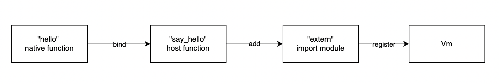

# Hello World

## Overview

In this example, we will demonstrate how to use the WasmEdge Rust APIs in a simple Hello-World project to

- Define and register a host function into WasmEdge Runtime; then,
- Run the host function in WasmEdge Runtime.

## Prerequisites

### Rust-lang

Assume that `Rust 1.63-nightly or above` is installed in your build environment. If you don't have `Rust` installed yet, refer to [Rust-lang installation guide](https://www.rust-lang.org/tools/install) to install

### Install WasmEdge Runtime Library

To install the WasmEdge runtime library, refer to [wasmedge-installation](https://wasmedge.org/book/en/quick_start/install.html#wasmedge-installation-and-uninstallation)

## Hello-World Example

Let's create a `Hello World` Rust project. Open a terminal program, and type and run the following command in your favorite local directory to create a Rust project named "say_hello":

```bash
$ cargo new say_hello --bin
```

The project structure looks like below:

```bash
say_hello
├── Cargo.toml
└── src
    └── main.rs

1 directory, 2 files
```

Now, let's get started to add more stuff into the project files.

### Add dependencies

The first thing we want to do is to add `wasmedge-sdk` crate as a dependency. To import the crate into our example, open the `Cargo.toml` file, and add `wasmedge-sdk` in the `[dependencies]` section.

```toml
# Cargo.toml

...

[dependencies]
wasmedge-sdk = "0.6.0"
```

In the next subsections, we will follow the basic steps depicted in the diagram below to reach the goal of "registering" the name function into a `Vm`.



- First, define a native function named `hello`;
- Then, create a host function named `say_hello`, to which the native function `hello` is bound;
- Create an import module named `extern`, and add the host function `say_hello` to the module;
- Finally, register the import module `extern` into a `Vm`.

### Define a host function

Let's open the `src/main.rs` file and remove the template code in it. Then, add the following code in `main.rs`:

```rust
// main.rs

use wasmedge_sdk::{error::HostFuncError, host_function, Caller, WasmValue};

#[host_function]
fn hello(_caller: Caller, _args: Vec<WasmValue>) -> Result<Vec<WasmValue>, HostFuncError> {
    println!("Hello, world!");

    Ok(vec![])
}
```

In the code above, we defined a native function named `hello`, which simply prints a message on the screen. This function will be bound to a host function of `wasmedge_sdk::Func` type later. In the context of WasmEdge Runtime, if we would like to bind a native function to a host function, the native function has to satisfy the following two requirements:

- The signature of the native function must match the signature template below. As for the details of each type in the signature, you can refer to [wasmedge-sdk API document](https://wasmedge.github.io/WasmEdge/wasmedge_sdk/).

  ```rust
  fn native_func_name(caller: Caller, args: Vec<WasmValue>) -> Result<Vec<WasmValue>, HostFuncError>
  ```

- The native function is paired with the proc-macro `#[host_function]`. The macro serves as a syntax sugar that helps reduce the complexity of the signature of native functions to be bound with host functions. When we compile the example project, this proc-macro will expand the function signature into a complete form. If you have interests in what it does, you can run `cargo expand` in the root directory of the project in your terminal program, then you can obtain the expanded form. For saving space we ignore the topic here.

Next, we'll bind the `hello` function to the environment of WasmEdge Runtime.

### Register a host function in WasmEdge Runtime

To run a native function in WasmEdge Runtime, we first need to "register" the function as a host function into the environment of WasmEdge Runtime. We can reach the goal with `Vm` and `ImportObjectBuilder` objects:

- `Vm` stands for a *virtual machine*, which represents an execution environment of WasmEdge Runtime.
- `ImportObjectBuilder` is used to create a `ImportObject` module, which holds the given objects to be exported, including `Func`, `Memory`, `Global`, and `Table` external instances.

Now let's create a `Vm` first; and then, create an import module with `ImportObjectBuilder`:

```Rust
// main.rs

#![feature(never_type)]

use wasmedge_sdk::{
    ..., ImportObject, ImportObjectBuilder, Vm, ...
};

...

fn main() -> Result<(), Box<dyn std::error::Error>> {
    // create a new WasmEdge Vm instance
    let vm = Vm::new(None)?;

    // create an import_object module with the host function
    let import: ImportObject = ImportObjectBuilder::new()
        .with_func::<(), (), !>("say_hello", hello, None)?
        .build("extern")?;

    Ok(())
}

```

For simplicity, we just created a default `Vm` instance in the `main` function, in which only some default configuration options are enabled. For the details of the available configuration options, go to see [wasmedge_sdk::config](https://wasmedge.github.io/WasmEdge/wasmedge_sdk/config/index.html).

> Here is a thing to be noticed that we add `#![feature(never_type)]` at the top of `main.rs`, as `wasmedge-sdk` crate depends on an unstable Rust language feature `never_type` while creating a `Func` external instance.

In the code above, we use `with_func` API to implicitly create a host function `say_hello`, to which the native function `hello` we created in the previous subsection is bound. Then, by calling `build` API on an `ImportObjectBuild` instance, an import module is created, which is responsible for holding the host function `say_hello`. When we register the import module into a `Vm`, the host function `say_hello` is "registered" alongside it. Due to the native function `hello` bound to the host function `say_hello`, we informally say that the native function `hello` is "registered" into the  `Vm`.

> Another point worth a few words here is the generic types used in `with_func::<(), (), !>` API. The first `()` specifies the argument types of the host function to be bound, while the second `()` the return types. In this example the host function `say_hello` has no arguments and return value, therefore we just use `()` to declare the type info. `!` represents `never_type`, which is a type with no values.

Now we can register the import module we created above into `vm` with the  `Vm::register_import_module` API.

```rust
// main.rs

...

fn main() -> Result<(), Box<dyn std::error::Error>> {
  
    ...

    // register the import module into vm
    let vm = vm.register_import_module(import)?;

    Ok(())
}

```

### Run the registered host function

We registred the `say_hello` host function into the `vm` in the the last step. Now we can use `Vm::run_func` API to invoke the registered host function `say_hello` held by the `extern` module in `vm`.

```rust
// main.rs

#![feature(never_type)]

use wasmedge_sdk::{
    .., params, ..
};

..

fn main() -> Result<(), Box<dyn std::error::Error>> {
  
    ...

    let _ = vm.run_func(Some("extern"), "say_hello", params!())?;

    Ok(())
}

```

You may noticed that we used another syntax sugar `params!()` in the call to  `run_func` so that we can use values of Rust built-in types directly instead of WebAssembly values of `wasmedge_sdk::WasmValue` type. The latter would make the code cumbersome. In addition, the export function `say_hello` has no arguments, hence we leave the arguments of `params` macro empty.

Now we have already finished all coding work. The complete code looks like below:

```Rust
// main.rs

#![feature(never_type)]

use wasmedge_sdk::{
    error::HostFuncError, host_function, params, Caller, ImportObject, ImportObjectBuilder, Vm,
    WasmValue,
};

#[host_function]
fn hello(_caller: Caller, _args: Vec<WasmValue>) -> Result<Vec<WasmValue>, HostFuncError> {
    println!("Hello, world!");

    Ok(vec![])
}

fn main() -> Result<(), Box<dyn std::error::Error>> {
    // create a new WasmEdge Vm instance
    let vm = Vm::new(None)?;

    // create an import_object module with the host function
    let import: ImportObject = ImportObjectBuilder::new()
        .with_func::<(), (), !>("say_hello", hello, None)?
        .build("extern")?;

    // register the import module into vm
    let vm = vm.register_import_module(import)?;

    let _ = vm.run_func(Some("extern"), "say_hello", params!())?;

    Ok(())
}

```

### Build & run

Now open the terminal program and go to the root directory of this example project; then, run the following command to build the project:

```bash
// in the root directory of the `say_hello` project

$ cargo build --release
```

The command will download the dependecies and compile the project code into a binary named "say_hello". We can find the binary in the path `<root-dir>/target/release`. We can see "Hello, world!" printed on the screen after execute the binary:

```bash
// run the binary in the root directory of the `say_hello` project
$ ./target/release/say_hello

// the message displayed in the terminal
Hello, world!
```

## Wrap-up

In this article we use a simple example to demonstrate how to

1. Define a native function, which is bound to a host function. The native function should meet the signature requirement and be paird with a proc-macro `#[host_function]`;
2. Make use of `ImportObjectBuilder` to create an import module with a specified module name and "bind" the native function to the import module as an export host function;
3. Register the import module into an `Vm` via the `Vm::register_import_module` API;
4. Run an registered export host function via the `Vm::run_func` API by specifying the function name and the name of the module hosting the function.
